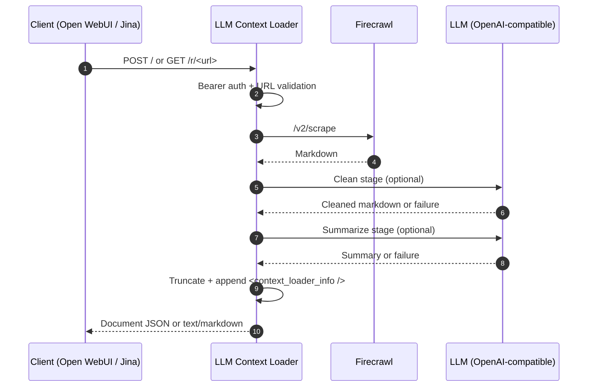

# LLM Context Loader

> Tiny LLM context loader: turns URLs into clean markdown for LLMs. Speaks Open WebUI's external web loader and Jina Reader-style `GET /r/<url>`; fetches via Firecrawl; optionally cleans via any OpenAI-compatible Chat Completions endpoint.

[](https://github.com/sousekd/llm-context-loader/actions/workflows/ci.yml)
[](https://github.com/sousekd/llm-context-loader/actions/workflows/release.yml)
[](LICENSE)
[](https://nodejs.org/)

A small HTTP service that turns a URL into markdown a language model can read. It fetches the page through Firecrawl, optionally passes it through one or two LLM stages (clean, then summarize), truncates the result, and can append an XML diagnostic footer explaining what happened.

## What it is

- A predictable URL-to-markdown adapter for LLM tooling.
- An Open WebUI external web-loader endpoint (`POST /`) and a Jina Reader-style endpoint (`GET /r/<url>`).
- An LLM-cleanup pipeline that degrades to the previous stage's best output when anything fails, instead of returning nothing.

## What it isn't

- Not a crawler, search engine, RAG framework, queue, database, or model router.
- Not a model gateway or a replacement for Firecrawl, Open WebUI, or the upstream LLM server.
- Not a chunker or vector index — that is the caller's job.

More detail: [docs/ARCHITECTURE.md](docs/ARCHITECTURE.md) · scope: [docs/ROADMAP.md](docs/ROADMAP.md) · release/deploy: [docs/RELEASING.md](docs/RELEASING.md) · agent contract: [AGENTS.md](AGENTS.md).

## Request flow



Each LLM stage can accept its output, reject it on quality grounds, time out, or be skipped because the input is too short or too long. On rejection or failure, the pipeline keeps the previous stage's content. With `DIAGNOSTIC_FOOTER_ENABLED=true` (the default), fetch failures return a small diagnostic document instead of an HTTP error.

## Quickstart

Requires Node 22+ for local runs, or Docker for the containerized path.

### Run locally

```bash
npm install
cp .env.example .env
# edit .env: FIRECRAWL_BASE_URL, LLM_BASE_URL, LLM_MODEL, and keys if needed
npm run dev
```

```powershell
npm install
Copy-Item .env.example .env
# edit .env: FIRECRAWL_BASE_URL, LLM_BASE_URL, LLM_MODEL, and keys if needed
npm run dev
```

Both `npm run dev` and `npm start` load `.env` through Node's `--env-file-if-exists` flag, so you do not need `dotenv`.

```bash
curl http://localhost:3010/health
curl http://localhost:3010/r/https://example.com
```

### Run with Docker (local build)

```bash
cp .env.example .env
docker compose up --build -d
curl http://localhost:3010/health
docker compose down
```

The default [compose.yaml](compose.yaml) builds from the current checkout, tags the image as `llm-context-loader:local`, publishes `SERVER_PORT` (default `3010`), and mounts `./templates` read-only at `/app/templates`.

> If Firecrawl or the LLM server runs on the host machine, `localhost` inside the container points at the container itself. Use a LAN address or `host.docker.internal` for host services.

### Run with Docker (published image)

Images are public on GitHub Container Registry.

```bash
cp .env.example .env
# edit .env: provider URLs, model, keys, and LLMC_IMAGE_TAG (e.g. 0.1.0)
docker compose -f compose.deploy.yaml pull
docker compose -f compose.deploy.yaml up -d
```

The deploy file pulls `ghcr.io/sousekd/llm-context-loader:${LLMC_IMAGE_TAG:-latest}`. For repeatable deployment, pin `LLMC_IMAGE_TAG` to an immutable release such as `0.1.0`. Full deployment workflow: [docs/RELEASING.md](docs/RELEASING.md).

To run without Compose:

```bash
docker build -t llm-context-loader .
docker run --rm -p 3010:3010 --env-file .env llm-context-loader
```

## API

| Method | Path        | Purpose                                                                                       |
| ------ | ----------- | --------------------------------------------------------------------------------------------- |
| `POST` | `/`         | Open WebUI external web loader. Body: `{ "urls": ["https://..."] }`. Max 20 URLs per request. |
| `GET`  | `/r/<url>`  | Jina Reader-style URL-to-markdown. Also accepts `GET /r?url=<encoded-url>`.                   |
| `GET`  | `/health`   | Liveness probe. Always open, never affected by `CLIENTS` or auth.                             |

### `POST /` request and response

```http
POST /
Content-Type: application/json
Authorization: Bearer <optional token>

{"urls":["https://example.com/article"]}
```

```json
[
  {
    "page_content": "Markdown...\n\n<context_loader_info ... />",
    "metadata": {
      "source": "https://example.com/article",
      "loader": "llm-context-loader",
      "fetch_provider": "firecrawl",
      "llm_provider": "openai_chat",
      "returned": "clean",
      "final_chars": 6210,
      "fetch_status": "ok",
      "clean_status": "cleaned"
    }
  }
]
```

### `GET /r/<url>`

```bash
curl http://localhost:3010/r/https://example.com/article
curl "http://localhost:3010/r?url=https%3A%2F%2Fexample.com%2Farticle%3Fid%3D42"
```

Returns `text/markdown; charset=utf-8`. Compatibility with Jina Reader is intentionally limited to URL-to-markdown. Jina-specific optional headers, alternate output formats, image transcription, `/s/`, and `/g/` are not implemented.

## Integrations

### Open WebUI

In Open WebUI, set the external web loader to point at this service:

```yaml
environment:
    WEB_LOADER_ENGINE: "external"
    EXTERNAL_WEB_LOADER_URL: "http://llm-context-loader:3010/"
    EXTERNAL_WEB_LOADER_API_KEY: ""
```

When `AUTH_ENABLED=true`, set `EXTERNAL_WEB_LOADER_API_KEY` to the same value as this service's `API_KEY`.

## Fallbacks and diagnostics

With `DIAGNOSTIC_FOOTER_ENABLED=true` (the default) the service favors returning the best available document plus a machine-readable footer over returning nothing.

| Situation                                       | Result                                                                    |
| ----------------------------------------------- | ------------------------------------------------------------------------- |
| Fetch succeeds, clean accepts                   | Cleaned markdown, `returned="clean"`                                      |
| Summarize accepts                               | Summary markdown, `returned="summary"`                                    |
| Stage disabled or input too short/long          | Previous content kept, stage status explains the skip                     |
| LLM call fails, times out, or returns garbage   | Previous content kept, stage status explains the failure                  |
| Quality gate rejects stage output               | Previous content kept, status `quality_rejected` with reason              |
| Final body exceeds `TRUNCATE_TARGET_CHARS`      | Body cut near a word boundary, `returned="truncated"`                     |
| Fetch fails                                     | Diagnostic-only document, `returned="error"`                              |

With `DIAGNOSTIC_FOOTER_ENABLED=false`, no footer is appended. Fetch failures throw HTTP errors; every LLM-stage failure still falls back to previous content.

The quality gate rejects empty output, output that is not strictly smaller than its input, output below the configured minimum ratio, and (when enabled for a stage) output that introduces HTTP(S) URLs absent from the input.

## Authentication

| Direction               | Variables                                  | Behavior                                                                                            |
| ----------------------- | ------------------------------------------ | --------------------------------------------------------------------------------------------------- |
| Client → service        | `AUTH_ENABLED=true`, `API_KEY=<secret>`    | `POST /` and `GET /r/*` require `Authorization: Bearer <secret>`. `/health` stays open.             |
| Service → Firecrawl     | `FIRECRAWL_API_KEY=<key>`                  | Sends bearer auth to Firecrawl when set. Leave empty for unauthenticated self-hosted Firecrawl.     |
| Service → LLM provider  | `LLM_API_KEY=<key>`                        | Sends bearer auth to the OpenAI-compatible chat endpoint when set. Leave empty for local servers.   |

## Configuration

All configuration is environment variables. The complete, commented reference is in [.env.example](.env.example); [compose.yaml](compose.yaml) and [compose.deploy.yaml](compose.deploy.yaml) mirror the same keys for Compose runs.

The tables below list only the **commonly tuned** keys. Open `.env.example` for the full set, including every stage knob and template path.

### Docker Compose

| Variable           | Default                       | Notes                                                                          |
| ------------------ | ----------------------------- | ------------------------------------------------------------------------------ |
| `LLMC_LOCAL_IMAGE` | `llm-context-loader:local`    | Local image name used by `compose.yaml`. Ignored by the Node app.              |
| `LLMC_IMAGE_TAG`   | `latest`                      | Published image tag used by `compose.deploy.yaml`. Ignored by the Node app.    |

### Server and clients

| Variable                    | Default            | Notes                                                                  |
| --------------------------- | ------------------ | ---------------------------------------------------------------------- |
| `SERVER_PORT`               | `3010`             | HTTP listen port.                                                      |
| `LOG_LEVEL`                 | `info`             | pino log level.                                                        |
| `AUTH_ENABLED`              | `false`            | Enables inbound bearer auth on client routes.                          |
| `API_KEY`                   | empty              | Required when `AUTH_ENABLED=true`.                                     |
| `CLIENTS`                   | `openwebui,jina`   | Comma-separated client plugins. Empty serves only `/health`.           |
| `DIAGNOSTIC_FOOTER_ENABLED` | `true`             | Appends footer; converts fetch failures into diagnostic documents.     |

### Fetch provider

| Variable             | Default                            | Notes                                                  |
| -------------------- | ---------------------------------- | ------------------------------------------------------ |
| `FETCH_CONCURRENCY`  | `4`                                | Max concurrent upstream fetches across all requests.   |
| `FIRECRAWL_BASE_URL` | `http://firecrawl-api:3002`        | Base URL used for `/v2/scrape`.                        |
| `FIRECRAWL_API_KEY`  | empty                              | Optional Firecrawl bearer token.                       |

### LLM provider

| Variable          | Default                           | Notes                                                   |
| ----------------- | --------------------------------- | ------------------------------------------------------- |
| `LLM_BASE_URL`    | `http://localhost:8080/v1`        | OpenAI-compatible API base. Calls `/chat/completions`.  |
| `LLM_MODEL`       | `local-model`                     | Model value sent in chat-completions requests.          |
| `LLM_API_KEY`     | empty                             | Optional bearer token.                                  |
| `LLM_CONCURRENCY` | `1`                               | Max concurrent per-URL LLM workflows.                   |
| `LLM_EXTRA_BODY`  | empty                             | Example: `{"temperature":0.7, ...}`. Any key wins.      |

### Stages

| Variable                | Default | Notes                                                                 |
| ----------------------- | ------- | ----------------------------------------------------------------------|
| `CLEAN_ENABLED`         | `true`  | Enables the clean stage.                                              |
| `SUMMARIZE_ENABLED`     | `false` | Enables the summarize stage.                                          |
| `TRUNCATE_TARGET_CHARS` | `25000` | Final body cap before footer is appended. `0` disables truncation.    |

Each stage exposes the same knobs under a shared naming convention: `<STAGE>_ENABLED`, `<STAGE>_MIN_INPUT_CHARS`, `<STAGE>_MAX_INPUT_CHARS`, `<STAGE>_OUTPUT_RATIO`, `<STAGE>_TIMEOUT_SECONDS`, `<STAGE>_QUALITY_MIN_RATIO`, `<STAGE>_CHECK_URLS`. See `.env.example` for the full list and per-stage defaults.

Both LLM stages receive the same template variables: `url`, `title`, `content`. The footer template receives snake_case diagnostic variables produced by the application. Mustache auto-escaping is disabled; footer attributes are escaped in application code before rendering.

## Docker images

Published images live at `ghcr.io/sousekd/llm-context-loader`.

| Tag                | Updated when                            | Suggested use                                          |
| ------------------ | --------------------------------------- | ------------------------------------------------------ |
| `:X.Y.Z`           | A stable `vX.Y.Z` tag is pushed         | Immutable production pin.                              |
| `:X.Y`             | Latest stable patch in a minor series   | Production with automatic patch pickup after pull.     |
| `:latest`          | Latest stable release                   | Quick start or manually managed production.            |
| `:edge`, `:main`   | Every successful push to `main`         | Staging or testing unreleased code.                    |
| `:X.Y.Z-rc.N`      | A pre-release tag is pushed             | Hand-picked release candidate.                         |

Update or roll back by changing `LLMC_IMAGE_TAG`, then re-running `pull` and `up -d`. The full workflow, including how the tags are produced by CI, is in [docs/RELEASING.md](docs/RELEASING.md).

If you fork this project into a **private** repository, its GHCR package inherits that visibility and pulls then require authentication:

```bash
echo "$GHCR_TOKEN" | docker login ghcr.io -u <your-user> --password-stdin
```

## Development

```bash
npm run typecheck       # core sources
npm run typecheck:all   # core + tests
npm run build           # tsc -> dist/
npm test                # vitest run
```

Tests live under `tests/` and mirror `src/`. They use dependency injection with plain stubs — no mocking library. CI runs the same four commands; on pushes to `main`, CI also publishes `:edge` and `:main`. Stable and pre-release images are built by the release workflow when a `v*.*.*` git tag is pushed.

## License

[MIT](LICENSE).
