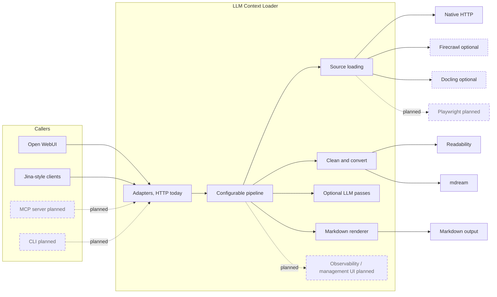

# LLM Context Loader

> URL in, markdown out for self-hosted LLM tooling.

[](https://github.com/sousekd/llm-context-loader/actions/workflows/ci.yml)
[](https://github.com/sousekd/llm-context-loader/actions/workflows/release.yml)
[](LICENSE)
[](https://nodejs.org/)

LLM Context Loader is a small HTTP service that turns web URLs into markdown that can be passed to an LLM. It is meant for self-hosted AI stacks where search returns links, but another component still needs to fetch, clean, convert, and optionally refine those pages before they enter the model context.

The public contract is deliberately small: callers send URLs, configured pipelines load and process each URL, and adapters return markdown in the shape the caller expects. The implementation behind that contract is meant to be replaceable: source providers, transformers, LLM passes, renderers, pipeline steps, and adapters are all separate building blocks.



## What Ships Today

- HTTP adapters for [Open WebUI](https://github.com/open-webui/open-webui) external web loader requests and limited [Jina Reader](https://github.com/jina-ai/reader)-style `GET /r` requests.
- A default `full` pipeline with source loading, [Readability](https://github.com/mozilla/readability), [mdream](https://github.com/harlan-zw/mdream) HTML-to-markdown conversion, optional LLM clean/summarize passes, URL verification, truncation, and optional XML diagnostics.
- Source providers for native HTTP fetch, [Firecrawl](https://github.com/firecrawl/firecrawl), and [Docling](https://github.com/docling-project/docling).
- Docker and GHCR image support.

The `smoke` pipeline is also shipped for testing and debugging. It uses only native HTTP fetch, aggressive mdream conversion, and truncation.

## Quick Start

Requires Node 22+.

```bash
npm install
cp .env.example .env
npm run dev
```

PowerShell:

```powershell
npm install
Copy-Item .env.example .env
npm run dev
```

Check the server:

```bash
curl http://localhost:3010/health
curl http://localhost:3010/r/https://example.com
```

Both `npm run dev` and `npm start` load `.env` through Node's `--env-file-if-exists` flag.

## Docker

Build and run locally from the checkout:

```bash
cp .env.example .env
docker compose up --build -d
curl http://localhost:3010/health
```

Run the published image:

```bash
cp .env.example .env
docker compose -f compose.deploy.yaml pull
docker compose -f compose.deploy.yaml up -d
```

For repeatable deployments, set `LLMC_IMAGE_TAG` in `.env` to an immutable release tag instead of `latest`.

## HTTP API

| Method | Path       | Purpose                                                              |
| ------ | ---------- | -------------------------------------------------------------------- |
| `POST` | `/`        | Open WebUI external web loader. Body: `{ "urls": ["https://..."] }`. |
| `GET`  | `/r/<url>` | Jina Reader-style URL-to-markdown route.                             |
| `GET`  | `/r?url=`  | Query-string form of the Jina-style route.                           |
| `GET`  | `/health`  | Liveness probe. Always open.                                         |

Open WebUI example:

```yaml
environment:
  WEB_LOADER_ENGINE: "external"
  EXTERNAL_WEB_LOADER_URL: "http://llm-context-loader:3010/"
  EXTERNAL_WEB_LOADER_API_KEY: ""
```

When `OWUI_AUTH_TOKEN` is configured, set `EXTERNAL_WEB_LOADER_API_KEY` to the same value.

## Configuration And Customization

There are two layers:

- Bootstrap environment variables choose the config file, host, port, and logging behavior.
- YAML declares adapters, providers, renderers, pipelines, steps, templates, timeouts, and concurrency groups.

Start with [.env.example](.env.example) and [docs/CONFIGURATION.md](docs/CONFIGURATION.md) when you want to run the shipped service. Read [docs/CUSTOMIZATION.md](docs/CUSTOMIZATION.md) when you want to change pipeline wiring or add building blocks.

## Documentation

- [docs/ARCHITECTURE.md](docs/ARCHITECTURE.md) explains the extensible architecture and internal boundaries.
- [docs/CONFIGURATION.md](docs/CONFIGURATION.md) is the operator guide for running the shipped configuration.
- [docs/CUSTOMIZATION.md](docs/CUSTOMIZATION.md) covers YAML pipelines and extension points.
- [docs/ROADMAP.md](docs/ROADMAP.md) records scope and direction.
- [docs/TESTING.md](docs/TESTING.md) describes tests and useful commands.
- [docs/RELEASING.md](docs/RELEASING.md) records release and deployment workflow.

## Development Commands

```bash
npm run typecheck       # source typecheck
npm run typecheck:all   # source + tests typecheck
npm run build           # tsc -> dist/
npm test                # vitest run --coverage
```

## License

[MIT](LICENSE).
