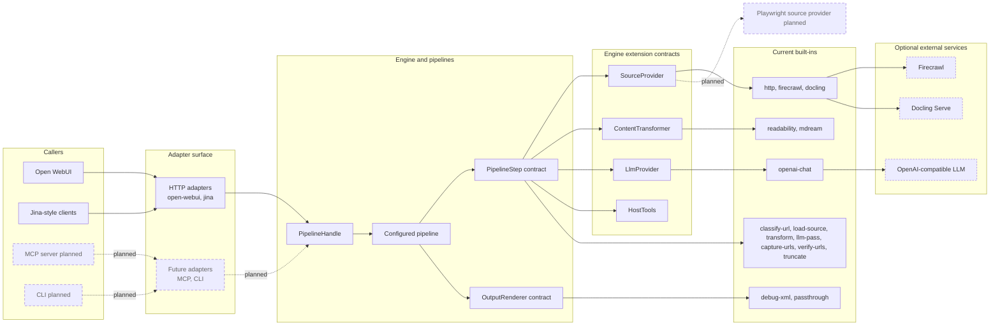
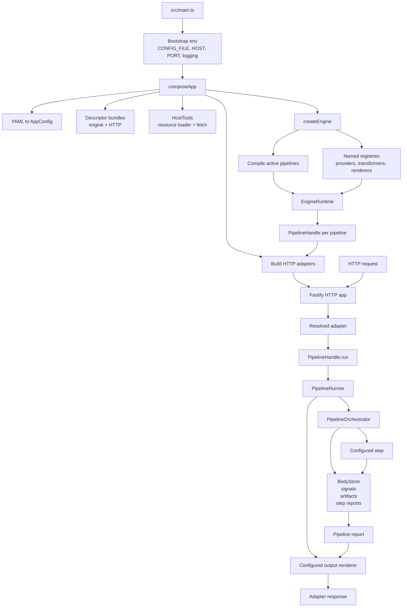

# Architecture

This document explains how LLM Context Loader is put together and where new pieces fit. The source code is the authority; this file is the map.

The project is engine-first: adapters expose caller-specific APIs, the engine owns configured pipelines, and built-ins sit behind small contracts. HTTP is the first adapter surface, not the only shape the engine is designed to support.

## Extensible Shape

At the public architecture level, the important idea is that most useful variation happens behind contracts. Adding another source loader, transformer, LLM provider, renderer, pipeline step, or adapter should be a localized change.



Current extension contracts:

| Contract             | Owns                                     | Current built-ins                                                                                 |
| -------------------- | ---------------------------------------- | ------------------------------------------------------------------------------------------------- |
| `HttpAdapter`        | Inbound routes and caller response shape | `open-webui`, `jina`                                                                              |
| `PipelineStep`       | One pipeline action and its effects      | `classify-url`, `load-source`, `transform`, `llm-pass`, `capture-urls`, `verify-urls`, `truncate` |
| `SourceProvider`     | URL-to-document retrieval                | `http`, `firecrawl`, `docling`                                                                    |
| `ContentTransformer` | Body conversion or cleanup               | `readability`, `mdream`                                                                           |
| `LlmProvider`        | Chat-completions style text generation   | `openai-chat`                                                                                     |
| `OutputRenderer`     | Final markdown rendering                 | `debug-xml`, `passthrough`                                                                        |
| `HostTools`          | Host-owned singletons used by extensions | resource loading, HTTP fetch                                                                      |

## Runtime Internals

The lower-level flow separates app assembly from engine construction and request execution.



Startup follows one path:

```text
src/main.ts
  -> loadEnvConfig()
  -> composeApp()
  -> createEngine()
  -> buildHttpApp()
  -> Fastify listen
```

At request time:

```text
HTTP adapter
  -> PipelineHandle bound to one compiled pipeline
  -> PipelineRunner
  -> PipelineOrchestrator
  -> configured OutputRenderer
  -> adapter response shape
```

## Source Layout

```text
src/
  shared/                    framework-free support: errors, logging, URLs, limiters, templates
  contracts/                 framework-free contracts grouped by intent
    pipeline/                pipeline ports, context, reports, conditions, handles
    extensions/              provider, transformer, renderer, registry contracts
    host/                    HostTools and ExtensionServices contracts
  core/                      framework-free pipeline runtime
  engine/                    programmatic engine API, config types, runtime builders
  builtins/                  engine built-ins behind descriptors
  adapters/http/             Fastify host, HTTP adapter contracts, HTTP built-ins
  bundles/                   default engine descriptor bundle
  app/                       service assembly and host-tool construction
  config/                    env parsing, YAML loading, YAML-to-AppConfig translation
  main.ts                    process entry point
tests/                       mirrors src/ and enforces boundaries
scripts/                     developer smoke helpers
```

## Dependency Boundaries

The import graph is enforced by [tests/architecture/import-boundaries.test.ts](../tests/architecture/import-boundaries.test.ts). The important rules are:

- `src/shared/` stays framework-free and does not construct runtime objects.
- `src/contracts/` defines ports and types without importing Fastify, YAML, app assembly, or `src/core/`.
- `src/core/` executes pipelines without knowing about providers, adapters, YAML, Fastify, Firecrawl, OpenAI, or HTTP caller contracts.
- `src/engine/` builds registries, compiles pipelines, and exposes `EngineRuntime`. It does not import YAML, HTTP, built-ins, bundles, Fastify, `src/app/`, or `main.ts`.
- `src/builtins/` contains individual engine built-ins. Descriptor bundles are the only files that aggregate multiple concrete built-ins.
- `src/adapters/http/` owns Fastify integration and HTTP adapter built-ins. Adapters consume `PipelineHandle`; they do not reach into compiled pipeline internals.
- `src/config/` translates env and YAML into `AppConfig`. It validates shape but does not construct providers, renderers, pipelines, or adapters.
- `src/app/` selects descriptor bundles, creates host tools, calls `createEngine(...)`, and binds adapters to pipeline handles.

When adding a new top-level layer, adapter surface, or built-in category, update the architecture test in the same change.

## Pipeline Runtime

The pipeline runtime is representation-aware and framework-free. A body is either text or binary:

- Text bodies carry `content`, `mediaType`, and optional title.
- Binary bodies carry `bytes`, `mediaType`, and optional title.

Steps return a closed status set: `ok`, `skipped`, `degraded`, or `failed`. They request mutations through effects: body, signals, and artifacts. Effects are applied only for `ok` and `degraded` results.

Coordination channels are deliberately separate:

- `signals` are scalar values used by later gates such as `runIf` and `skipIf`.
- `artifacts` carry typed data between steps, such as captured trusted URLs.
- `diagnostics` are observability-only and appear in reports/renderers. Later steps do not read them.

`PipelineOrchestrator` owns step ordering, runtime gates, timeouts, concurrency groups, effect application, and step reports. `PipelineRunner` binds a compiled pipeline to its output renderer and exposes the result through `PipelineHandle`.

A binary body that reaches the end of a pipeline without conversion is a failed run: `unconverted_binary: <mediaType>`.

## Configuration Model

Bootstrap environment is intentionally small: `CONFIG_FILE`, `HOST`, `PORT`, `LOG_LEVEL`, and `LOG_PRETTY`.

YAML contains the configurable service shape: HTTP adapters, source providers, content transformers, LLM providers, output renderers, pipelines, steps, templates, limiters, and timeouts. YAML is translated to `AppConfig` before engine construction.

Validation is lazy for reachable runtime objects. Providers and renderers are constructed only when an active pipeline references them, so unused optional dependencies can remain unconfigured.

## Extension Model

Each implementation type uses a descriptor:

```text
type          YAML type string
parseConfig   implementation-local config parsing
create        factory for the runtime instance
```

Runtime instances are behavior-only. Configured identity (`name`, `type`) lives in resolved wrappers built during construction. Registries hold those wrappers, and steps resolve named providers, transformers, LLM providers, and renderers through `ExtensionServices`.

The default engine descriptor bundle lives in [src/bundles/default-engine-descriptors.ts](../src/bundles/default-engine-descriptors.ts). The default HTTP adapter descriptor bundle lives in [src/adapters/http/descriptor-bundle.ts](../src/adapters/http/descriptor-bundle.ts).

For YAML-level changes, see [CUSTOMIZATION.md](CUSTOMIZATION.md). For implementation guidance when adding a built-in inside this repository, see [docs/agents/extension-authoring.md](agents/extension-authoring.md).

## Errors, Logging, And Security

Intentional errors are grouped in [src/shared/errors.ts](../src/shared/errors.ts): client errors, configuration errors, upstream errors, and internal errors. Provider implementations convert degradable external failures to `UpstreamError`; steps classify those failures into stable pipeline reasons.

Logging uses pino. Request correlation fields are stored in AsyncLocalStorage by [src/shared/request-context.ts](../src/shared/request-context.ts) and merged into log lines by [src/shared/logger.ts](../src/shared/logger.ts).

Security-sensitive paths are tracked in [docs/agents/security-boundaries.md](agents/security-boundaries.md). URL validation, inbound bearer auth, upstream error-code sanitization, provider response parsing, and XML escaping stay in their owning layers.
