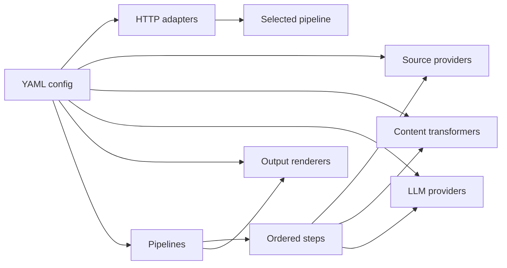
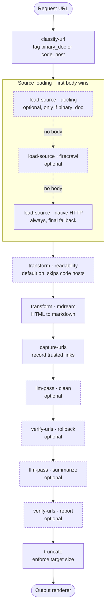
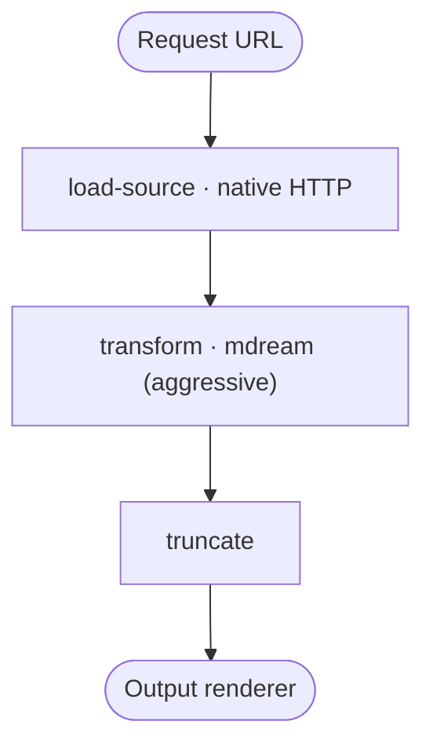

# Customization

This guide covers the YAML configuration surface: adapters, providers, transformers, renderers, pipelines, steps, and the built-in knobs used to wire them together.

For running the shipped configuration through environment variables, read [CONFIGURATION.md](CONFIGURATION.md). For the implementation details of adding a built-in inside this repository, read [docs/agents/extension-authoring.md](agents/extension-authoring.md).

## Mental Model

The default config is [config/llm-context-loader.yaml](../config/llm-context-loader.yaml). It declares named instances of building blocks, then wires those instances into pipelines.



Most top-level sections are maps keyed by instance name:

```yaml
schemaVersion: 1
httpAdapters: {}
outputRenderers: {}
sourceProviders: {}
contentTransformers: {}
llmProviders: {}
pipelines: {}
```

`schemaVersion` is required and must be `1`. Paths used by step templates are resolved relative to the YAML file directory.

Configured implementation instances generally look like this:

```yaml
some-name:
  type: built-in-type
  config: {}
```

HTTP adapters also choose the pipeline they expose:

```yaml
some-adapter:
  type: open-webui
  pipeline: ${DEFAULT_PIPELINE:-full}
  config: {}
```

## Shipped Pipelines

The default config ships two pipelines. `DEFAULT_PIPELINE` selects which pipeline the shipped HTTP adapters expose.

The `full` pipeline is the default quality path. A request flows top to bottom; dashed steps are optional and run only when enabled and eligible for the URL.



`load-source` is fallback-style: if a previous source step already produced a body, later source steps skip with `body_present`. This lets the `full` pipeline try optional, higher-value source paths before falling back to native HTTP fetch.

The `smoke` pipeline is primarily for testing and debugging. It has no external dependencies and is not the main quality path.



## Pipeline Shape

A pipeline selects one renderer, declares optional concurrency groups, and lists steps in order:

```yaml
pipelines:
  full:
    outputRenderer: ${DEFAULT_OUTPUT_RENDERER:-debug-xml}
    limiters:
      source: ${SOURCE_CONCURRENCY:-1}
      process: ${PROCESS_CONCURRENCY:-5}
      llm: ${LLM_CONCURRENCY:-1}
    steps: []
```

Pipeline activation is tri-state:

- `enabled: true` compiles the pipeline whether or not an adapter references it.
- `enabled: false` parks the pipeline.
- Omitted `enabled` compiles the pipeline only when an adapter references it.

Step declarations have common orchestration fields plus type-specific config:

```yaml
- type: llm-pass
  name: clean_llm
  concurrencyGroup: llm
  timeoutSeconds: 90
  enabled: ${LLM_CLEAN_ENABLED:-false}
  runIf: binary_doc
  skipIf: code_host
  config: {}
```

Common fields:

| Field              | Purpose                                                    |
| ------------------ | ---------------------------------------------------------- |
| `type`             | Step implementation type. Required.                        |
| `name`             | Unique step name inside the pipeline. Required.            |
| `enabled`          | Compile-time include/exclude toggle. Defaults to `true`.   |
| `runIf`            | Runtime signal gate. Runs only when the predicate is true. |
| `skipIf`           | Runtime signal gate. Skips when the predicate is true.     |
| `concurrencyGroup` | Optional limiter group name.                               |
| `timeoutSeconds`   | Timeout for limiter wait and step execution.               |
| `config`           | Type-specific step configuration.                          |

Adjacent steps with the same `concurrencyGroup` share one limiter acquisition. Inserting another step between them splits the acquisition.

## Conditional Step Execution

`runIf` and `skipIf` read runtime signals emitted by earlier steps. A bare signal name checks whether that signal exists and is truthy:

```yaml
runIf: binary_doc
skipIf: code_host
```

Structured predicates support `all`, `any`, and `not`:

```yaml
runIf:
  all:
    - binary_doc
    - not: code_host

skipIf:
  any:
    - is_pdf
    - is_office_doc
```

When a gate prevents execution, the step is recorded as skipped with `run_if_unmet` or `skip_if_met`.

## HTTP Adapters

Adapters register inbound routes and bind them to one configured pipeline.

### `open-webui`

Default route: `POST /`.

```yaml
config:
  path: /
  maxUrls: 20
  auth:
    bearerToken: ${OWUI_AUTH_TOKEN:-}
```

Request body: `{ "urls": ["https://..."] }`. The response is a list of Open WebUI document rows shaped as `{ page_content, metadata }`. Each URL is handled independently.

### `jina`

Default route: `GET /r` and `GET /r/*`.

```yaml
config:
  path: /r
  auth:
    bearerToken: ${JINA_AUTH_TOKEN:-}
```

Accepts both `GET /r/<url>` and `GET /r?url=<url>` and returns `text/markdown`.

## Source Providers

Source providers turn an input URL into a typed text or binary document.

### `http`

```yaml
config:
  userAgent: "Mozilla/5.0 ..."
  maxBytes: 5000000
  titleFromHtml: true
```

The native HTTP provider is useful for local testing and fallback behavior. It fetches the input URL directly, caps response size, preserves text media types, and returns binary bodies for binary responses. It has no SSRF protection; use it only in trusted deployments.

### `firecrawl`

```yaml
config:
  baseUrl: ${FIRECRAWL_BASE_URL:-}
  apiKey: ${FIRECRAWL_API_KEY:-}
  output: rawHtml
  options: ${FIRECRAWL_OPTIONS:-}
```

Calls Firecrawl `/v2/scrape`. `output` can be `markdown`, `html`, or `rawHtml`. `options` is an opaque object merged into the scrape body; Firecrawl's provider-managed `formats` field cannot be overridden through `options`.

### `docling`

```yaml
config:
  baseUrl: ${DOCLING_BASE_URL:-}
  apiKey: ${DOCLING_API_KEY:-}
  output: markdown
  options: ${DOCLING_OPTIONS:-}
```

Calls Docling Serve `POST /v1/convert/source`. `output` can be `markdown` or `html`. `options` is an opaque object merged into the convert body; provider-managed output format fields cannot be overridden.

## Content Transformers

Transformers rewrite the current pipeline body in-process.

### `readability`

```yaml
config:
  minContentLength: ${READABILITY_MIN_CONTENT_CHARS:-140}
  minScore: ${READABILITY_MIN_SCORE:-20}
  maxElements: ${READABILITY_MAX_ELEMENTS:-0}
```

Extracts main-article HTML from HTML input using Mozilla Readability. It may decline non-article pages; the transform step then skips by default.

### `mdream`

```yaml
config:
  clean: ${MDREAM_CLEAN:-true}
```

Converts HTML to markdown using `@mdream/js`. The shipped config declares two instances:

- `mdream-convert` converts HTML to markdown after Readability.
- `mdream-aggressive` uses mdream's minimal preset for the testing/debugging `smoke` pipeline.

## LLM Providers

### `openai-chat`

```yaml
config:
  baseUrl: ${LLM_BASE_URL:-}
  apiKey: ${LLM_API_KEY:-}
  model: ${LLM_MODEL:-}
  contextTokens: ${LLM_CONTEXT_TOKENS:-}
  charsPerToken: ${LLM_CHARS_PER_TOKEN:-3.5}
  safetyMarginTokens: ${LLM_SAFETY_MARGIN_TOKENS:-128}
  extraBody: {}
```

Uses an OpenAI-compatible `/chat/completions` endpoint. One provider instance corresponds to one model. To use several models, declare several provider instances with different names.

`contextTokens` enables a character-estimated context-fit gate. Providers with no configured context limit report prompts as fitting.

## Output Renderers

Renderers turn a completed pipeline run into markdown.

### `debug-xml`

```yaml
config:
  rootElement: loader_info
  includeSkipped: false
```

Returns the final body plus an XML diagnostic footer. If no body was produced, it returns the footer by itself.

### `passthrough`

```yaml
config: {}
```

Returns the current text body without a diagnostic footer, or the pipeline error message when a failed run produced no body.

## Steps

### `classify-url`

Emits boolean signals from URL rules:

```yaml
config:
  rules:
    - signal: binary_doc
      extensionIn: [pdf, docx, doc]
    - signal: code_host
      anyHost: [github.com, gitlab.com]
```

Matchers: `pattern`, `anyHost`, and `extensionIn`. Multiple rules may emit the same signal for OR semantics.

### `load-source`

Loads the initial body from a named source provider:

```yaml
config:
  provider: http-default
```

Skips with `body_present` when an earlier source step already produced a body.

### `transform`

Runs a named content transformer toward a target media type:

```yaml
config:
  transformer: mdream-convert
  target: text/markdown
  onUnsupported: skip
  onDeclined: skip
  emitDiagnostics: false
```

### `llm-pass`

Runs a prompt-rendered LLM transformation against the current text body:

```yaml
config:
  provider: llm-default
  minInputChars: 1000
  outputReserveRatio: 1.0
  templates:
    system: ../templates/clean.system.md
    user: ../templates/clean.user.md
```

The Mustache template context includes `url`, `title`, `content`, and any literal values under `templates.vars`.

### `capture-urls`

Captures trusted source URLs from the current body into an artifact:

```yaml
config:
  artifact: trusted-urls
```

Place it before LLM passes when later verification should detect hallucinated URLs.

### `verify-urls`

Compares URLs in the current body against the artifact written by `capture-urls`:

```yaml
config:
  artifact: trusted-urls
  onHallucination: rollback
  maxReportedUrls: 50
```

`onHallucination` can be `report` or `rollback`. Rollback restores the prior body version and marks the run degraded.

### `truncate`

Truncates the current body when it exceeds `targetChars`:

```yaml
config:
  targetChars: 25000
```

`targetChars: 0` disables truncation by making the step skip.

## Opaque Passthrough Fields

Some provider fields accept arbitrary object data merged into outgoing upstream request bodies: Firecrawl `options`, Docling `options`, and OpenAI-compatible `extraBody`.

Supported authoring modes:

| Mode                          | Example                               | Behavior                                                              |
| ----------------------------- | ------------------------------------- | --------------------------------------------------------------------- |
| Inline YAML object            | `options:\n  do_ocr: true`            | YAML types are preserved.                                             |
| Single env var JSON blob      | `options: ${DOCLING_OPTIONS:-}`       | The env value is parsed as JSON; blank becomes `{}`.                  |
| Mixed inline env placeholders | `options:\n  do_ocr: ${DO_OCR:-true}` | Placeholder values become strings. Prefer one of the first two modes. |

Example:

```dotenv
DOCLING_OPTIONS='{"do_ocr":true,"table_mode":"accurate"}'
```

## Adding Code Building Blocks

YAML can wire any descriptor that the hosted app knows about. Adding a new implementation inside this repository is a code change:

1. Add the implementation and descriptor under the matching built-in folder.
2. Add the descriptor to the appropriate descriptor bundle.
3. Add YAML examples or defaults only when the shipped configuration should expose it.
4. Add focused tests under the mirrored test path.

The detailed implementation guide is [docs/agents/extension-authoring.md](agents/extension-authoring.md). The dependency-boundary checklist is [docs/agents/architecture-rules.md](agents/architecture-rules.md).
